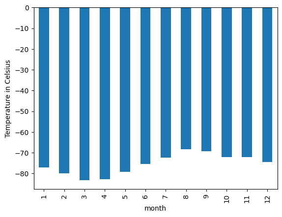
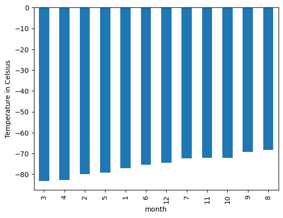
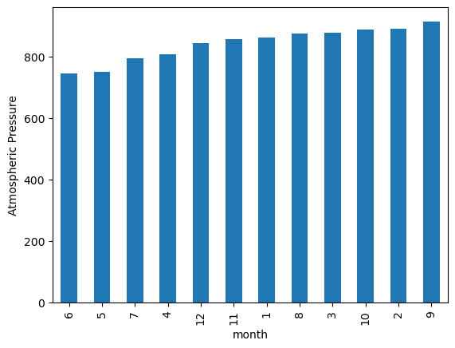
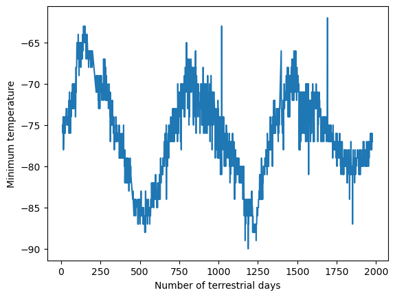

# beautiful_soup_challenge

This assignment requires students to scrape information from two web pages, save data files and create some plots.

---

## Aims

### 1. Scrape titles and preview text from Mars news articles

Use beautiful soup, splinter and pandas to visit the URL https://static.bc-edx.com/data/web/mars_news/index.html, scrape text elements, store in a dictionary and save in a json file.

### 2. Scrape and Analyse Mars Weather Data

Use beautiful soup, splinter, matplotlib and pandas to visit the URL https://static.bc-edx.com/data/web/mars_facts/temperature.html, scrape the data table and store as a pandas DataFrame, perform plotting and analysis of the data, and save the dataframe as a csv file.

---

## Results

### 1. Scrape titles and preview text from Mars news articles

Scraped text elements were saved as a list of dictionaries:

```
[
 {
    'title': "NASA's MAVEN Observes Martian Light Show Caused by Major Solar Storm",
  'preview': 'For the first time in its eight years orbiting Mars, NASA’s MAVEN mission witnessed two different types of ultraviolet aurorae simultaneously, the result of solar storms that began on Aug. 27.'
  },
 {
    'title': "NASA Prepares to Say 'Farewell' to InSight Spacecraft",
  'preview': 'A closer look at what goes into wrapping up the mission as the spacecraft’s power supply continues to dwindle.'
  },
 {
    'title': 'NASA and ESA Agree on Next Steps to Return Mars Samples to Earth',
  'preview': 'The agency’s Perseverance rover will establish the first sample depot on Mars.'
  },
 {
    'title': "NASA's InSight Lander Detects Stunning Meteoroid Impact on Mars",
  'preview': 'The agency’s lander felt the ground shake during the impact while cameras aboard the Mars Reconnaissance Orbiter spotted the yawning new crater from space.'
  },
 {
    'title': 'NASA To Host Briefing on InSight, Mars Reconnaissance Orbiter Findings',
  'preview': 'Scientists from two Mars missions will discuss how they combined images and data for a major finding on the Red Planet.'
  },
 {
    'title': 'Why NASA Is Trying To Crash Land on Mars',
  'preview': 'Like a car’s crumple zone, the experimental SHIELD lander is designed to absorb a hard impact.'
  },
 {
    'title': 'Curiosity Mars Rover Reaches Long-Awaited Salty Region',
  'preview': 'After years of climbing, the Mars rover has arrived at a special region believed to have formed as Mars’ climate was drying.'
  },
 {
    'title': 'Mars Mission Shields Up for Tests',
  'preview': 'Protecting Mars Sample Return spacecraft from micrometeorites requires high-caliber work.'
  },
 {
    'title': "NASA's InSight Waits Out Dust Storm",
  'preview': 'InSight’s team is taking steps to help the solar-powered lander continue operating for as long as possible.'
  },
 {
    'title': "NASA's InSight 'Hears' Its First Meteoroid Impacts on Mars",
  'preview': 'The Mars lander’s seismometer has picked up vibrations from four separate impacts in the past two years.'
  },
 {
    'title': "NASA's Perseverance Rover Investigates Geologically Rich Mars Terrain",
  'preview': 'The latest findings provide greater detail on a region of the Red Planet that has a watery past and is yielding promising samples for the NASA-ESA Mars Sample Return campaign.'
  },
 {
    'title': 'NASA to Host Briefing on Perseverance Mars Rover Mission Operations',
  'preview': 'Members of the mission will discuss the rover’s activities as it gathers samples in an ancient river delta.'
  },
 {
    'title': "NASA's Perseverance Makes New Discoveries in Mars' Jezero Crater",
  'preview': 'The rover found that Jezero Crater’s floor is made up of volcanic rocks that have interacted with water.'
  },
 {
    'title': "10 Years Since Landing, NASA's Curiosity Mars Rover Still Has Drive",
  'preview': 'Despite signs of wear, the intrepid spacecraft is about to start an exciting new chapter of its mission as it climbs a Martian mountain.'
  },
 {
    'title': "SAM's Top 5 Discoveries Aboard NASA's Curiosity Rover at Mars",
  'preview': '“Selfie” of the Curiosity rover with inset showing the SAM instrument prior to installation on the rover.'
  }
  ]
  ```
The list of dictionaries was saved as a json file:
[articles.json](articles.json)

### 2. Scrape and Analyse Mars Weather Data

There are 12 months on Mars

There are 1867 Martian days' worth of data

1. Plot of monthly average minimum temperatures


2. Plot of monthly average minimum temperatures sorted by average temperature


The coldest month in Curiosity's location is month 3 at -83.30729166666667 Celsius

The hottest month in Curiosity's location is month 8 at -68.38297872340425 Celsius

3. Plot of monthly average atmospheric pressure sorted by average pressure


The month with lowest average atmospheric pressure is month 6 at 745.0544217687075 Pascals

The month with highest average atmospheric pressure is month 9 at 913.3059701492538 Pascals

4. Plot of daily minimum temperatures


From the local minima in the plot above, it appears about 700 days elapse on Earth in the time that Mars circles the Sun once.

The dataframe was saved as a csv file: [mars_data.csv](mars_data.csv)
